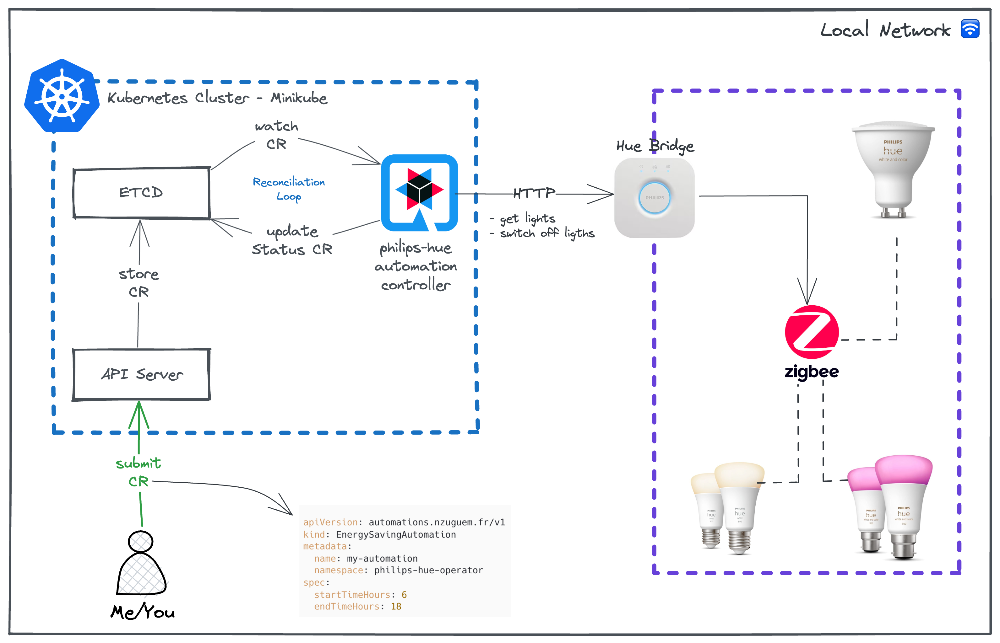

# What is this project ?
This project aims to experiment and understand the Kubernetes operator pattern.

To give it a realistic dimension, I've chosen the energy and IoT sector, under the prism of energy sobriety.

The idea is to develop a Kubernetes operator that will help reduce our energy consumption. This is achieved by acting on Philips Hue connected lights during a configured period.

# Illustration



# I'm testing this

If you have a hue bridge at home with connected lights, then follow the steps below to launch and/or modify this project.

> 🥲 Otherwise, it will be impossible to test it

## Philips Hue configuration
1. Get hue bridge IP
   ```bash
   curl https://discovery.meethue.com
   # Response -> [{"id":"ID_du_pont","internalipaddress":"<HUE_BRIDGE_IP>"}]
   ```
2. Obtain an authentication token, to be able to place commands to the Hue system
    > ⚠️ Before executing the command below, press the button on top of the Bridge, this will put it in pairing mode.
   ```bash
    curl -X POST -d '{"devicetype":"my_hue_app#philips-hue-operator"}' <HUE_BRIDGE_IP>/api
    # Response -> [{"success":{"username":"<HUE_BRIDGE_API_TOKEN>"}}]
   ```

## Launch the project
### Prerequisites
- Must have Java 17 + (You can install it via [SDKMan][sdkman-doc])
- Have a local kubernetes cluster (you can use [Minikube][minikube-install])

### Execute command
```bash
./mvnw quarkus:dev -DHUE_API_URL="http://<HUE_BRIDGE_IP>" -DHUE_API_TOKEN="<HUE_BRIDGE_API_TOKEN>"; 
```

### Submit your first automation 🚀
You can modify [energy-saving-automation.yml](src/test/resources/energy-saving-automation.yml) as you wish
```yaml
apiVersion: automations.nzuguem.fr/v1
kind: EnergySavingAutomation
metadata:
  name: my-automation
  namespace: philips-hue-operator
spec:
  startTimeHours: 6
  endTimeHours: 18
```

```bash
kubectl create ns philips-hue-operator 
```
```bash
# If you have kubectl installed
kubectl apply -f src/test/resources/energy-saving-automation.yml
```

# Would you like to go to PROD 😁 ?
You have just tested the project in Dev Mode Quarkus💙 and only the CRDs (Custom Resource Definition) are deployed in your cluster, BUT not your controller.

Your goal is to deploy the controller in your cluster.

## Go PROD 🚀
1. Build the Docker image using Minikube's Docker daemon, Docker images will be directly accessible in the Kubernetes cluster, without the need for a registry.
```bash
eval $(minikube -p minikube docker-env)
make docker-build
```

2.  Create the namespace, secret and configmap required by the controller
```bash
k8s/configure.sh "<HUE_BRIDGE_IP>" "<HUE_BRIDGE_API_TOKEN>"
```

3. Apply yaml manifests generated by the Kubernetes Quarkus extension
> 💙 Yes !!! YAML manifests are generated by Quarkus. The strength of Quarkus lies in its extensions, and in our case, it's the Kubernetes extension.
```bash

# Apply CRDs
kubectl apply -f target/kubernetes/esas.automations.nzuguem.fr-v1.yml
# Apply Controller
kubectl apply -f target/kubernetes/minikube.yml
```

# Useful links 🔗
- [Quarkus][quarkus-doc]
- [Quarkus Java Operator SDK][quarkus-josdk-doc]
- [Kubernetes Operator pattern][k8s-operator-pattern]

<!-- Links -->
[sdkman-doc]: https://sdkman.io/
[minikube-install]: https://minikube.sigs.k8s.io/docs/start/
[quarkus-doc]: https://quarkus.io/
[quarkus-doc]: https://quarkus.io/
[quarkus-josdk-doc]: https://docs.quarkiverse.io/quarkus-operator-sdk/dev/index.html
[k8s-operator-pattern]: https://kubernetes.io/docs/concepts/extend-kubernetes/operator/